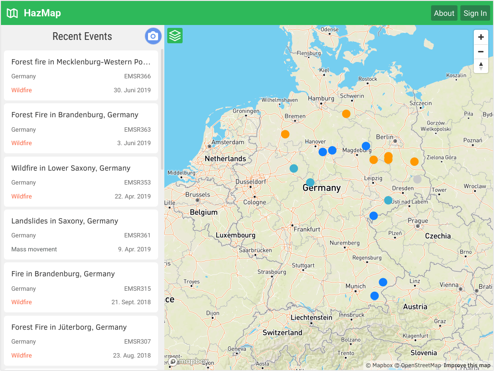

# HazMap app

The HazMap app supports the management of natural hazards and disaster events by providing its users data from complementing European and national open sources including that collected through crowdsourcing. The app aggregates actionable information and allows professional users (civil protection, water and environmental management, policy makers) but also citizens to effectively prevent and react against disasters. 

The HazMap app integrates information from Copernicus EMS with data from complementing open sources and allows users to collect hazard related information through geo-tagged photos and annotations directly in the field.

This is the source code for the hazmap app. A running prototype lives at https://hazmap.terranea.com/.



## Used Technologies and Data

### Client:
The app was created as a single page app and uses the following open source technologies:  
* User interface and interactivity: [Svelte](https://svelte.dev/)
* Map rendering: [Mapbox Gl JS](https://docs.mapbox.com/mapbox-gl-js/api/)
* Data sync and authentication: [Firebase js sdk](https://github.com/firebase/firebase-js-sdk)

### Backend:
* Data storage: [Cloud Firestore](https://firebase.google.com/docs/firestore)
* Picture and file storage: [Cloud Storage](https://firebase.google.com/docs/storage)
* User authentication and authorization: [Firebase Authentication](https://firebase.google.com/docs/auth)

### Data:
* Disaster Events: [Copernicus EMS Activations](https://emergency.copernicus.eu/mapping/list-of-activations-rapid)
* Flood Risk: [BFG OpenData](https://geoportal.bafg.de/portal/Query/ShowCSWInfo.do?fileIdentifier=7cc44618-f44e-40e3-a8ac-4006cd42f2a4)
* Gauge Stations: [Pegelonline](https://pegelonline.wsv.de/gast/start)
* Landcover: [Corine LC BKG](https://gdz.bkg.bund.de/index.php/default/corine-land-cover-10-ha-clc10.html)
* Critical Infrastructure: extracted from [OSM](https://www.openstreetmap.org) data

## Get started

Download the source code:

```bash
git clone https://github.com/terranea/hazmap.git
cd hazmap
```

Install the dependencies...

*Note that you will need to have [Node.js](https://nodejs.org) installed.*

```bash
cd hazmap
npm install
```

...then run the development server to start the app:

```bash
npm run dev
```

Navigate to [localhost:5000](http://localhost:5000). You should see your app running.

### Mapbox and Firebase Credentials

You need a Firebase and a Mapbox account for the app to work. Put an .env file with your own environment variables (see below) in the root directory.

.env file example:
```
MAPBOX_ACCESS_TOKEN=your-key
FIREBASE_apiKey=your-key
FIREBASE_authDomain=your-domain
FIREBASE_databaseURL=your-dburl
FIREBASE_projectId=your-projectId
FIREBASE_storageBucket=your-bucketID
FIREBASE_messagingSenderId=your-msgSenderId
FIREBASE_appId=your-appId
```


## Build the app

Run the build command to build it for the web:

```bash
npm run build
```

all neessary files are located in the folder "public"
